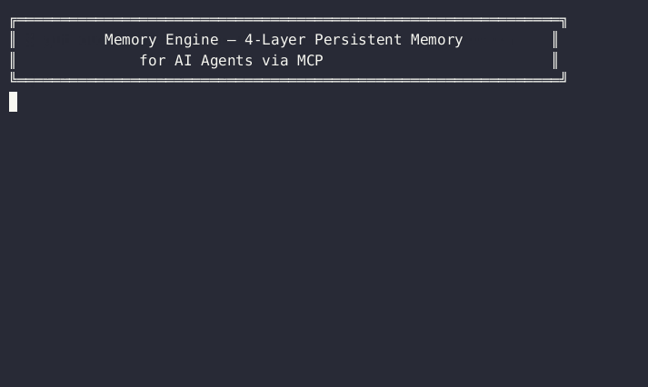
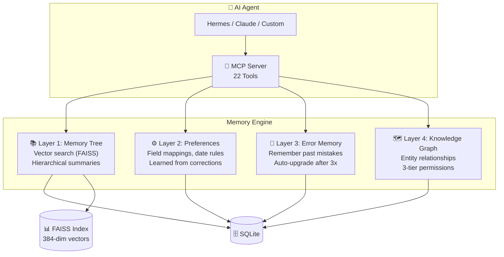

# Memory Engine

[](https://github.com/qq1009128320-dotcom/memory-engine/actions/workflows/ci.yml)
[](https://www.python.org/)
[](LICENSE)
[](https://github.com/qq1009128320-dotcom/memory-engine/releases)
[](https://github.com/astral-sh/ruff)

> **4-layer persistent memory for AI agents via MCP.**  

<p align="center">
  
</p>
> Correct it once. It remembers forever.

---

## Why Memory Engine?

Every AI conversation starts from scratch — until now. Memory Engine gives your agent persistent memory across sessions, organized in four specialized layers:

| Traditional AI | With Memory Engine |
|---|---|
| Resets every conversation | Remembers across sessions |
| Makes the same mistakes repeatedly | Learns from corrections automatically |
| You re-explain context every time | Auto-retrieves relevant memories |
| Zero domain knowledge accumulation | Continuously learns your rules and preferences |

## Architecture: 4-Layer Memory



| Layer | Name | Function | Inspired By |
|-------|------|----------|-------------|
| L1 | Memory Tree | External data ingestion + vector search + hierarchical summaries | OpenHuman |
| L2 | Preferences | Learns rules and habits from user corrections | Mem0 |
| L3 | Error Memory | Remembers mistakes; auto-upgrades to rules after 3 occurrences | **原创 (Original)** |
| L4 | Knowledge Graph | Entity/relationship management with 3-tier permissions | Zep |

## Quick Start

```bash
# 1. Clone & install
git clone https://github.com/qq1009128320-dotcom/memory-engine.git
cd memory-engine
python3 -m venv venv && source venv/bin/activate
pip install -r requirements.txt

# 2. Initialize database
python3 -c "from memory_server import _init_db; _init_db()"

# 3. Start MCP Server (Ctrl+C to exit)
python3 memory_server.py
```

## Features

- **4 specialized memory layers** — Tree, Preferences, Error Memory, Knowledge Graph
- **22 MCP tools** — Full surface accessible via MCP protocol
- **Hybrid search** — FAISS vector search (384-dim, <3ms hot) + keyword fallback
- **Auto-learning** — Errors logged; ≥3 occurrences auto-upgrade to hard rules
- **Auto-fact extraction** — Extracts entities, preferences, and corrections from conversations
- **Hierarchical summaries** — L0 (global) → L1 (grouped topics) → L2 (raw blocks)
- **Health check & audit** — 30-point comprehensive audit built-in
- **Deployment options** — Lightweight (FAISS+SQLite) / Heavy (Milvus+PostgreSQL+Redis)
- **Third-party sync** — Feishu/Lark, local files, database tables
- **Docker + systemd** — Production-ready with OOM protection

## Benchmarks

| Operation | Cold Start | Hot Query |
|-----------|-----------|-----------|
| Vector Search (FAISS) | ~500ms (model load) | **~3ms** |
| Keyword Search | — | **~0.1ms** |
| Cross-layer Search | — | **~0.1ms** |

## MCP Tools

### Memory Tree (External Data)
- `memory_tree_ingest` — Ingest data (auto-embeds via FAISS)
- `memory_tree_vector_search` — Semantic vector search (recommended)
- `memory_tree_search` — Keyword search (fallback)
- `memory_tree_fetch` — Get full content by ID
- `memory_tree_score` — Adjust memory relevance score
- `memory_tree_reindex` — Rebuild FAISS index
- `memory_tree_summary` — L0/L1/L2 hierarchical summaries

### Preferences (Learned Rules)
- `preference_add` / `preference_search` / `preference_list` / `preference_disable`

### Error Memory (Don't Repeat Mistakes)
- `error_check` — Check before execution: has this task failed before?
- `error_log` — Log an error + user correction
- `error_list` — List unresolved errors

### Knowledge Graph
- `entity_add` / `entity_search` / `entity_link` / `graph_query`

### Cross-layer
- `memory_search` — Search all 4 layers at once
- `memory_stats` — Memory statistics overview
- `memory_health` — Health check + operational metrics

## Auto Fact Extraction

```bash
python3 run_extraction.py --text "User: Check Tencent's R&D expenses
Agent: Found it. R&D spending: 2.83 billion yuan.
User: Use the amt_jpy field, not base_amt.
Agent: Got it, I've noted that."
```

Automatically extracts: field aliases → preference rules | corrections → error memory | entities → knowledge graph.

## Environment Variables

| Variable | Description | Default |
|----------|-------------|---------|
| `DEEPSEEK_API_KEY` | DeepSeek API key (for extraction/summary) | (optional) |
| `MEMORY_DB_PATH` | SQLite database path | `./memory.db` |
| `FAISS_INDEX_PATH` | FAISS index path | `./faiss.index` |
| `EMBEDDING_MODEL` | Embedding model name | `all-MiniLM-L6-v2` |
| `LLM_MODEL` | LLM model for extraction | `deepseek-chat` |
| `LLM_TIMEOUT` | LLM request timeout (seconds) | `30` |

## Deployment Options

| Option | Specs | Best For |
|--------|-------|----------|
| Lightweight (FAISS+SQLite) | 2 vCPU, 2GB RAM | Personal / small team |
| Heavy (Milvus+PG+Redis) | 8 vCPU, 16GB RAM | Enterprise / 10M+ vectors |

### One-click Deploy

```bash
chmod +x deploy.sh
./deploy.sh
```

Automates: Python check → venv creation → deps install → DB init → FAISS rebuild → verification.

## Production Hardening

- ✅ FAISS concurrent write lock (thread-safe)
- ✅ Request rate limiting (BoundedSemaphore 50)
- ✅ Log rotation + redaction (API keys auto-filtered)
- ✅ Config validation on startup
- ✅ Input sanitization (NULL bytes, control chars)
- ✅ PID file lock (prevents duplicate process spawn)
- ✅ WAL auto-checkpoint (every 5 min)
- ✅ Daily backup script (integrity_check → gzip → 30-day retention)
- ✅ OOM protection (systemd MemoryMax)
- ✅ Docker multi-stage build (non-root user)

## Ecosystem

### Hermes Agent
Add to `config.yaml`:

```yaml
mcp_servers:
  enterprise-memory:
    command: /path/to/venv/bin/python3
    args: ["/path/to/memory_server.py"]
```

Or connect to existing HTTP server (port 8765):

```yaml
mcp_servers:
  enterprise-memory:
    url: "http://127.0.0.1:8765/mcp"
```

### Claude Code / Codex CLI / Any MCP Client
Memory Engine speaks standard MCP protocol. Connect any MCP-compatible agent.

## Project Structure

```
├── memory_server.py        # MCP Server (22 tools)
├── schema.sql              # Database schema (6 tables)
├── run_extraction.py       # End-to-end fact extraction
├── extract_facts.py        # LLM prompt templates
├── summary_tree.py         # Hierarchical summary generator
├── auto_fetch.py           # Feishu auto-sync
├── observability.py        # Metrics + observability
├── validators.py           # Input validation
├── config.py               # Unified configuration
├── log_utils.py            # Logging utilities
├── audit.py                # 30-point comprehensive audit
├── deploy.sh               # One-click deployment
├── Dockerfile              # Docker image
├── docker-compose.yml      # Docker Compose
└── memory-engine.service   # systemd unit
```

## Comparison with Alternatives

| Feature | Memory Engine | agentmemory | Mem0 | Zep | Letta |
|---------|:------------:|:------------:|:----:|:---:|:-----:|
| Memory layers | **4** | 1 | 2 | 2 | 1 |
| Error auto-learning | **✅** | ❌ | ❌ | ❌ | ❌ |
| FAISS vector search | **✅** | ❌ (custom) | ✅ | ✅ | ❌ |
| 0 external DBs | **✅** | ✅ | ❌ (cloud) | ❌ (cloud) | ❌ (cloud) |
| MCP protocol | **✅** | ✅ | ❌ | ❌ | ❌ |
| Self-hosted | **✅** | ✅ | ❌ | ✅ (limited) | ❌ |
| Heavy deployment | **✅** | ❌ | ❌ | ❌ | ❌ |
| Production audit | **✅** | ❌ | ❌ | ❌ | ❌ |
| Feishu/Lark sync | **✅** | ❌ | ❌ | ❌ | ❌ |
| Open Source | **✅ MIT** | ✅ Apache 2.0 | ✅ | ✅ | ✅ |

## Roadmap

- [x] v2.0 — FAISS migration, 22 MCP tools, production hardening
- [x] v2.1 — CI/CD, Docker, comprehensive audit, embedding timeout protection
- [x] v2.2 — Cross-layer search, error auto-upgrade, 84 tests passing
- [ ] v2.3 — English documentation, GitHub Pages site, benchmark suite
- [ ] v2.4 — Multi-agent memory coordination (ShadowClone-X integration)
- [ ] v3.0 — Milvus production deploy, horizontal scaling, enterprise SSO

## License

MIT

---

## 记忆引擎 — 中文说明

四层 Agent 记忆系统。让 Agent 越用越聪明，越用越懂你。

### 核心理念

```text
传统 AI：每次从头开始，能力不变
记忆引擎：每次被纠正就更聪明一点
```

### 快速开始（中文）

```bash
git clone https://github.com/qq1009128320-dotcom/memory-engine.git
cd memory-engine
python3 -m venv venv && source venv/bin/activate
pip install -r requirements.txt
python3 -c "from memory_server import _init_db; _init_db()"
python3 memory_server.py
```

### 四层架构

| 层 | 名称 | 功能 | 借鉴 |
|----|------|------|------|
| L1 | Memory Tree | 外部数据感知，向量检索 + 层级摘要 | OpenHuman |
| L2 | 偏好记忆 | 从纠正中自动学习规则和习惯 | Mem0 |
| L3 | 纠错记忆 | 记住错误，≥3 次自动升级为永久规则 | **独创** |
| L4 | 知识图谱 | 实体关系 + 三级权限 | Zep |

### 更多文档

详见中文版 README 的完整说明（本文件上半部分为英文、下半部分为中文）。

### GitHub

https://github.com/qq1009128320-dotcom/memory-engine
